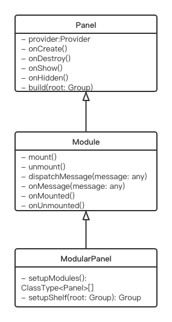

在软件开发中模块化方案可以提高代码复用率,降低项目复杂度,提升测试及维护效率等.
在Doric中提供了一套TS层实现的模块化拆解及组装方案,在 version >= `v0.8.0`版本即可使用.

# API
## 基本单元
### Panel
Panel为Doric中的视图控制单元,可作为一个单独的页面运行,也可用于模块化方案中可组装的模块单元.
### Module
Module是Panel的子类,在Panel的API之外提供消息通信及数据监听等API.
### ModularPanel
ModularPanel是Module的子类,可作为Module之上的组装体,也可被其他ModularPanel组装嵌套使用.
### Provider
提供全局数据的读写、监听及更新等能力
## UML

## 模块化框架的使用
1. 根据已划分模块分别继承`Module`实现子类,在该类中实现当前模块的视图及业务处理逻辑
1. 继承`ModularPanel`实现子类,通过如下两个方法提供出模块视图的父视图,以及其子模块的清单.该子类可继续嵌入更上层的`ModularPanel`的子类,也可以直接加上`@Entry`注解直接展示.
```typescript
/**
 * @returns Class list of current submodules
 */
abstract setupModules(): ClassType<Panel>[];
/**
 * @param root Current module's rootview
 * @returns provided for submodules as their rootview
 */
abstract setupShelf(root: Group): Group;
```

## 模块的装载与卸载
`Module`在实例化后会直接装载到当前页面,但也可以通过API卸载或者再次装载进来.
```typescript
mount(): void;
unmount(): void;
```
当模块发生装载或卸载时,整个页面会被重新绘制.
而被卸载的模块也会触发如下的回调:
```typescript
/**
* Called when this module is mounted
*/
onMounted(): void;
/**
* Called when this module is unmounted
*/
onUnmounted(): void;
```
## 模块间通信
模块化开发应遵循高内聚,低耦合的原则.当需要模块间通信时,我们可以通过Message机制进行消息传递.
### 发送Message
您可以调用`Module`中接口发送消息给当前视图中所有Module.
```typescript
/**
* Dispatch message to other modules.
* @param message which is sent out
*/
dispatchMessage(message: any): void;
```
### 接收Message
您可以在`Module`中复写下面的方法,实现对已发送消息的处理.
```typescript
/**
* Dispatched messages can be received by override this method.
* @param message recevied message
*/
onMessage(message: any): void;
```
**请注意: 已卸载的模块无法接收到`Message`.**

## 模块生命周期
一个模块在装载后,可以被当作一个普通的`Panel`使用.可以接收到页面的生命周期回调.
```typescript
onCreate(): void;
onDestroy(): void;
onShow(): void;
onHidden(): void;
```
**请注意: 已卸载的模块无法触发生命周期回调.**

## 共享数据Provider的使用

页面中多个模块间可能共享某一部分数据,这种情况下使用`Message`会较为繁琐,且较难保持一致性.Doric中提供了`Provider`类,作为这种情况下的解决方案.

### 定义数据类
Provider中是根据类名区分数据类型的.所以您需要给数据定义一个Class.
```typescript
class ProvidedData {
    received: string[] = []
    mounted: Record<string, boolean> = {}
}
```
### 创建Provider实例
最上层的`Module`需要负责初始化Provider实例,该`Module`下所有子`Module`都可以访问到同一Provider实例.
```typescript
@Entry
class ModularDemo extends ModularPanel {
    constructor() {
        super()
        this.provider = new Provider
        this.provider.provide(new ReceivedMessage)
    }
    ......
}
```


### 数据更新

#### 数据更新写入
```typescript
this.provider?.observe(ProvidedData).update((data) => {
    if (!data) {
        data = new ProvidedData
    }
    return data
})
```
**请注意: 该方式会触发数据监听回调.**

#### 添加数据监听
```typescript
this.provider?.observe(ProvidedData).addObserver(data => {
            loge("Data changed", data)
})
```

#### 取消数据监听
```typescript
this.provider?.observe(ProvidedData).removeObserver(observer)
```

### 数据直接读写
在初始化或回收资源时直接在Provider中添加删除数据
#### 数据直读
```typescript
const providedData = this.provider?.acquire(ProvidedData)
```
#### 数据直写
```typescript
this.provider.provide(new ReceivedMessage)
```
**请注意: 该方式下无法触发数据监听回调.**

#### 数据直删
```typescript
this.provider?.remove(ProvidedData)
```

#### 数据清空
```typescript
this.provider?.clear()
```


# Demo
您可以查看这个[Demo](https://github.com/doric-pub/Doric/blob/master/doric-demo/src/ModularDemo.ts),这里有具体的用法.